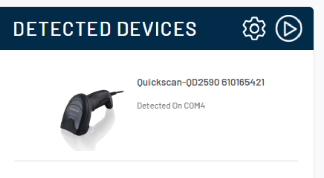

* Installeer de "Aladdin Setup Standalone Application"  via [deze link](https://www.datalogic.com/page/search?search_txt=aladdin+setup).
* Hang scanner aan computer via USB.
* Start Aladdin.
* Indien de scanner niet in de lijst aan de linkerkant getoond wordt, klik op "Device detection". In het volgende scherm klik je op "Search". Normaal verschijnt de scanner nu in de lijst en kan je deze selecteren.
    
* In het volgende scherm kan je de scanner instellen. Het is aangeraden om eerst de scanner te resetten via de oranje knop "Reset EU factory configuration".
* Klik vervolgens in de linkermenu op "Interface selection" en kies daar "USB Keyboard parameters". 
* Je kan nu de opties instellen. Je hoeft enkel volgenden 2 opties in te stellen:
    * "Keyboard Country Mode" , zet op **"French international (Belgian French)"**
    * "Encoding type", zet op "UTF_8"
    
* Finaliseer de settings nu naar de scanner te schrijven via de oranje knop "Write configuration" aan de rechterzijde.
* Eens dit klaar is kan je via de de knop "Terminal" (vlak boven de Write configuration knop) testen of de scanner correct ingesteld is. Scan een barcode en kijk of de juiste karakters verschijnen in het terminal venster.

